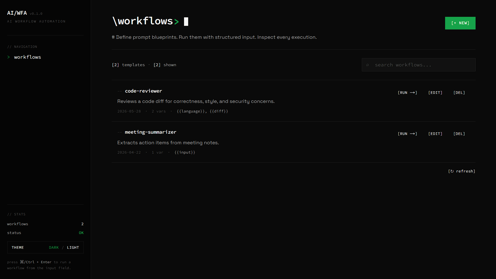

# AI Workflow Automation Engine

A lightweight, full-stack internal tool designed to help users define, manage, and execute reusable AI-driven workflow templates. Built to transform complex prompt engineering into a simple, scalable dashboard.

### 🔗 **[Live Site](https://ai-workflow-automation-tool-production.vercel.app/)** | ⚙️ **[Backend API](https://david-srvr.ostrich-hoki.ts.net:10000)**

<br>

<div align="center">
  
</div>

<br>

## 💡 Overview

This project was developed to bridge the gap between raw AI capabilities and practical business operations. It allows users to create prompt "blueprints" with dynamic variables (e.g., `{{input}}`), which can then be executed on-demand via a clean UI. 

The architecture strictly separates the frontend presentation layer from the secure backend execution engine, ensuring API keys and database credentials remain completely isolated from the client.

## 🛠️ Tech Stack

**Frontend**
* **Framework:** Next.js (App Router)
* **Styling:** Tailwind CSS
* **Components:** React Markdown (for rendering AI outputs)
* **Deployment:** Vercel

**Backend**
* **Framework:** NestJS
* **Database:** PostgreSQL (hosted on Supabase)
* **ORM:** Prisma
* **AI Integration:** Google Generative AI SDK (Gemini 2.5 Flash Lite)
* **Deployment:** Self-hosted (Docker + Tailscale Funnel)

## ✨ Key Features

* **Dynamic Prompt Templates:** Create and store reusable prompts with dynamic payload injection.
* **Secure AI Orchestration:** The backend acts as a secure proxy, managing the Gemini API connection, rate limits, and error handling (e.g., catching `429 Too Many Requests`).
* **Execution History:** Every workflow run is logged to the PostgreSQL database with its status (pending, success, failed) and timestamp for full traceability.
* **CORS-Protected API:** The NestJS backend is configured to safely accept cross-origin requests from the Vercel frontend domain.

## 🚀 Local Setup & Development

If you wish to run this project locally, you will need two separate terminal windows for the frontend and backend.

### Prerequisites
* Node.js (v18+)
* A Supabase project (PostgreSQL)
* A Google Gemini API Key

### 1. Backend Setup
```bash
cd backend
npm install
```

Create a `.env` file in the `backend` directory:
```env
DATABASE_URL="your_supabase_connection_string"
GEMINI_API_KEY="your_gemini_api_key"
PORT=3000
```

Generate the Prisma client and start the server:
```bash
npx prisma generate
npm run start:dev
```
*The backend will be running on `http://localhost:3000`*

### 2. Frontend Setup
```bash
cd frontend
npm install
```

Create a `.env.local` file in the `frontend` directory:
```env
NEXT_PUBLIC_API_URL="http://localhost:3000"
```

Start the development server:
```bash
npm run dev
```
*The frontend will be running on `http://localhost:3001`*

## 🐳 Self-Hosted Deployment

The backend can be deployed to any Linux server using Docker and exposed publicly via Tailscale Funnel.

### Prerequisites
* Docker & Docker Compose v2
* Tailscale with Funnel enabled

### Steps
```bash
git clone https://github.com/davidalexander24/AI-Workflow-Automation-Tool.git
cd AI-Workflow-Automation-Tool/backend

cp .env.example .env
chmod 600 .env
# Edit .env with your DATABASE_URL and GEMINI_API_KEY

docker compose up -d --build
```

Expose publicly via Tailscale Funnel:
```bash
sudo tailscale funnel --bg --https 10000 http://localhost:3001
```

The API will be available at `https://<your-hostname>.ts.net:10000`.

## 🗄️ Database Schema

The database relies on two primary models managed by Prisma:
1. `Workflow`: Stores the template configuration, name, description, and the raw prompt string.
2. `WorkflowRun`: Tracks individual executions, linking them to a specific Workflow ID, and storing the dynamic input payload and the resulting AI output.
