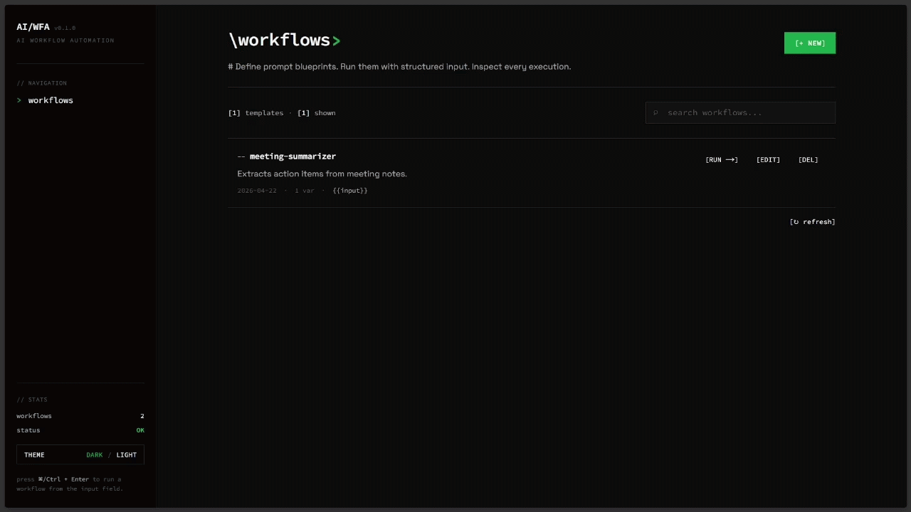

# AI Workflow Automation Engine

A lightweight, full-stack internal tool designed to help users define, manage, and execute reusable AI-driven workflow templates. Built to transform complex prompt engineering into a simple, scalable dashboard.

### **[Live Site](https://ai-workflow-automation-tool-production.vercel.app/)** | **[Backend API](https://david-srvr.ostrich-hoki.ts.net:10000)**

<br>

<div align="center">
  
</div>

<br>

## Overview

This project was developed to bridge the gap between raw AI capabilities and practical business operations. It allows users to create prompt "blueprints" with named dynamic variables (e.g., `Summarize {{document}} for {{audience}}`), then execute them on-demand against a model of their choice via a clean UI. Each run can target a different model and temperature, making it a lightweight lab for comparing prompt behavior across providers.

The architecture strictly separates the frontend presentation layer from the secure backend execution engine, ensuring API keys and database credentials remain completely isolated from the client.

## Tech Stack

**Frontend**
* **Framework:** Next.js (App Router)
* **Styling:** Tailwind CSS (brutalist terminal UI with a light/dark theme toggle)
* **Components:** React Markdown (for rendering AI outputs)
* **Deployment:** Vercel

**Backend**
* **Framework:** NestJS
* **Database:** PostgreSQL (hosted on Supabase)
* **ORM:** Prisma
* **AI Integration:** Multi-provider routing. Google Gemini via the Google Generative AI SDK (default), plus any OpenAI-compatible provider, GitHub Models, Groq, Cerebras, and OpenRouter.
* **Deployment:** Self-hosted (Docker + Tailscale Funnel)

### Supported Models

Models are grouped in the UI by their maker. Each is routed to the appropriate provider behind the scenes; only the providers whose API keys you supply are usable.

| Maker | Models | Provider |
| :--- | :--- | :--- |
| **Google** | Gemini 3.1 Flash Lite (default), 3.5 Flash, 3 Flash, 2.5 Flash, 2.5 Flash Lite | Google AI Studio |
| **OpenAI** | GPT-5, GPT-4o, GPT-4.1 Mini | GitHub Models |
| **OpenAI** | GPT-OSS 120B | Cerebras |
| **Meta** | Llama 3.3 70B, Llama 3.1 8B | Groq |
| **DeepSeek** | DeepSeek R1 | GitHub Models |
| **xAI** | Grok 3 | GitHub Models |
| **Alibaba** | Qwen3 32B | Groq |
| **Moonshot** | Kimi K2.6 | OpenRouter |
| **Z.ai** | GLM 4.7 | Cerebras |

## Key Features

* **Dynamic Prompt Templates:** Create reusable prompts with named `{{variable}}` tokens. The run page detects them and renders one labelled input per variable (falling back to a single text/JSON field for the legacy `{{input}}` convention).
* **Multi-Provider Model Selection:** Pick any model from a maker-grouped dropdown and adjust temperature per run. The backend routes each request to the correct provider (Google, GitHub Models, Groq, Cerebras, OpenRouter) and records the model and temperature used. Models that ignore custom temperature (e.g. GPT-5) are handled automatically.
* **Workflow Management:** Full create, edit, and delete for workflows, plus client-side search across the library.
* **Secure AI Orchestration:** The backend acts as a secure proxy, isolating every provider API key and normalizing upstream errors. Full provider error detail is logged server-side only; clients and run history get a generic message (provider `429 Too Many Requests` keeps its status so the UI can surface rate limiting).
* **Execution History:** Every run is logged with its status (pending, success, failed), timestamp, model, and temperature. Runs can be re-run with their original input and their output copied or downloaded as Markdown.
* **Hardened Public API:** Per-IP rate limiting (60 requests/min globally, 10 executions/min), request validation with length caps on every field, an environment-driven CORS allowlist (defaults to the Vercel frontend domain plus localhost), and helmet security headers. The backend runs as a non-root, capability-dropped container behind Tailscale Funnel, and the frontend ships a Content Security Policy.

## Local Setup & Development

If you wish to run this project locally, you will need two separate terminal windows for the frontend and backend.

### Prerequisites
* Node.js (v18+)
* A Supabase project (PostgreSQL)
* At least one provider API key. A free [Google Gemini](https://aistudio.google.com/apikey) key is recommended (it powers the default model); the others below are optional and only needed for their models.

### 1. Backend Setup
```bash
cd backend
npm install
```

Create a `.env` file in the `backend` directory. Only `DATABASE_URL` and at least one provider key are required; each additional key unlocks that provider's models:
```env
DATABASE_URL="your_supabase_connection_string"
GEMINI_API_KEY="your_gemini_api_key"
# Optional provider keys (omit any you don't use)
GITHUB_MODELS_TOKEN="your_github_pat_with_models_read_scope"
GROQ_API_KEY="your_groq_api_key"
CEREBRAS_API_KEY="your_cerebras_api_key"
OPENROUTER_API_KEY="your_openrouter_api_key"
PORT=3000
```

Generate the Prisma client and start the server:
```bash
npx prisma generate
npm run start:dev
```
*The backend will be running on `http://localhost:3000`*

### 2. Frontend Setup
```bash
cd frontend
npm install
```

Create a `.env.local` file in the `frontend` directory:
```env
NEXT_PUBLIC_API_URL="http://localhost:3000"
```

Start the development server:
```bash
npm run dev
```
*The frontend will be running on `http://localhost:3001`*

## Self-Hosted Deployment

The backend can be deployed to any Linux server using Docker and exposed publicly via Tailscale Funnel.

### Prerequisites
* Docker & Docker Compose v2
* Tailscale with Funnel enabled

### Steps
```bash
git clone https://github.com/davidalexander24/AI-Workflow-Automation-Tool.git
cd AI-Workflow-Automation-Tool/backend

cp .env.example .env
chmod 600 .env
# Edit .env with your DATABASE_URL and provider API key(s).
# Optionally set CORS_ORIGINS (comma-separated) to override the default
# allowlist of the production frontend origin plus localhost.

docker compose up -d --build
```

Expose publicly via Tailscale Funnel:
```bash
sudo tailscale funnel --bg --https 10000 http://localhost:3001
```

The API will be available at `https://<your-hostname>.ts.net:10000`.

## Database Schema

The database relies on two primary models managed by Prisma:
1. `Workflow`: Stores the template configuration, name, description, and the raw prompt string.
2. `WorkflowRun`: Tracks individual executions, linking them to a specific Workflow ID, and storing the dynamic input payload, the resulting AI output, the status, and the model and temperature used for the run.
