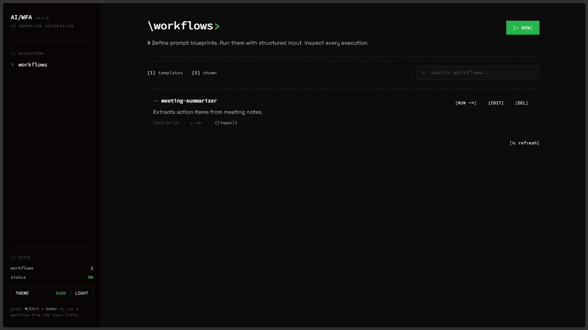
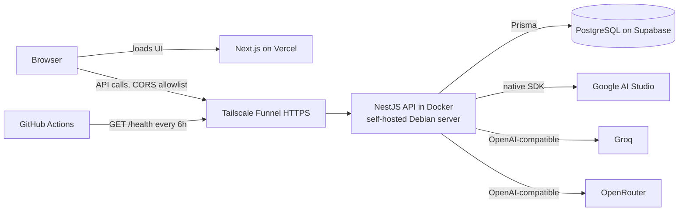

# AI Workflow Automation Engine

[](https://github.com/davidalexander24/AI-Workflow-Automation-Tool/actions/workflows/ci.yml)
[](https://github.com/davidalexander24/AI-Workflow-Automation-Tool/actions/workflows/uptime.yml)

A lightweight, full-stack internal tool designed to help users define, manage, and execute reusable AI-driven workflow templates. Built to transform complex prompt engineering into a simple, scalable dashboard.

### **[Live Site](https://ai-workflow-automation-tool-production.vercel.app/)** | **[Backend API](https://david-srvr.ostrich-hoki.ts.net:10000/health)**

<br>

<div align="center">
  
</div>

<br>

## Overview

This project was developed to bridge the gap between raw AI capabilities and practical business operations. It allows users to create prompt "blueprints" with named dynamic variables (e.g., `Summarize {{document}} for {{audience}}`), then execute them on-demand against a model of their choice via a clean UI. Each run can target a different model and temperature, and every run records its latency and token usage, making it a lightweight lab for comparing prompt behavior across providers.

The architecture strictly separates the frontend presentation layer from the secure backend execution engine, ensuring API keys and database credentials remain completely isolated from the client.

## Architecture


```mermaid
flowchart LR
  browser[Browser] -->|loads UI| vercel[Next.js on Vercel]
  browser -->|API calls, CORS allowlist| funnel[Tailscale Funnel HTTPS]
  funnel --> api[NestJS API in Docker<br/>self-hosted Debian server]
  api -->|Prisma| db[(PostgreSQL on Supabase)]
  api -->|native SDK| google[Google AI Studio]
  api -->|OpenAI-compatible| groq[Groq]
  api -->|OpenAI-compatible| openrouter[OpenRouter]
  actions[GitHub Actions] -->|GET /health every 6h| funnel
```

**How a run executes**

1. The run is written to the database as `pending` *before* any model call, so a crash or timeout still leaves an auditable record.
2. The template is filled in and sent to the requested model. Transient failures (upstream 5xx or a dropped connection) are retried on the same model with backoff (0.8s, then 2s).
3. If the model still fails, or fails in a way a retry cannot fix (delisted model, rate limit, timeout), the run falls back once to a model on a *different* provider. Each call is capped at 60s and the whole run at 90s.
4. The run is updated with the model that actually answered, the model that was requested (when a fallback was used), attempt count, latency, and prompt/completion tokens. Provider error text stays in the server logs; clients only see a sanitized message.

## Tech Stack

**Frontend**
* **Framework:** Next.js (App Router)
* **Styling:** Tailwind CSS (brutalist terminal UI with a light/dark theme toggle)
* **Components:** React Markdown (for rendering AI outputs)
* **Deployment:** Vercel

**Backend**
* **Framework:** NestJS
* **Database:** PostgreSQL (hosted on Supabase)
* **ORM:** Prisma
* **AI Integration:** Multi-provider routing. Google Gemini via the Google Gen AI SDK (default), plus OpenAI-compatible providers (Groq, OpenRouter) through one shared code path.
* **Deployment:** Self-hosted (Docker + Tailscale Funnel)
* **Testing & CI:** Jest unit and e2e tests, run with lint, typecheck, and a Docker build on every push via GitHub Actions

### Supported Models

Models are grouped in the UI by their maker. The model list is served by the backend (`GET /models`), which only lists models whose provider key is configured, so the UI and the server can never disagree about what is available.

| Maker | Models | Provider |
| :--- | :--- | :--- |
| **Google** | Gemini 3.8 Flash, 3.7 Flash, 3.6 Flash, 3.5 Flash, 3.5 Flash Lite (default), 3.1 Flash Lite | Google AI Studio |
| **OpenAI** | GPT-OSS 120B, GPT-OSS 20B | Groq |
| **Alibaba** | Qwen3.8 27B | Groq |
| **NVIDIA** | Nemotron 3 Ultra 550B, Nemotron 3 Super 120B | OpenRouter |
| **Cohere** | North Mini Code | OpenRouter |

## Key Features

* **Dynamic Prompt Templates:** Create reusable prompts with named `{{variable}}` tokens. The run page detects them and renders one labelled input per variable, falls back to a single text/JSON field for the `{{input}}` convention, and runs templates without variables as-is.
* **Multi-Provider Model Selection:** Pick any model from a maker-grouped dropdown and adjust temperature per run. The backend routes each request to the correct provider and records what was actually applied. Reasoning models keep their chain-of-thought out of the output.
* **Retries and Provider Fallback:** Transient provider errors are retried with backoff, and a failing model falls back to one on another provider. The fallback can be switched off per run when comparing models, so a failure shows as a failure.
* **Per-Model Stats:** Each workflow shows runs, success rate, fallback count, p50/p95 latency, and average output tokens per requested model, computed in PostgreSQL. A model that keeps needing a fallback shows up as unreliable instead of hiding behind its substitute.
* **Execution History:** Every run is logged with its status, timestamp, model, temperature, latency, attempts, and token usage. Runs can be re-run with their original input and their output copied or downloaded as Markdown.
* **Workflow Management:** Full create, edit, and delete for workflows, plus client-side search across the library.
* **Secure AI Orchestration:** The backend acts as a secure proxy, isolating every provider API key and normalizing upstream errors. Full provider error detail is logged server-side only; clients and run history get a generic message (provider `429 Too Many Requests` keeps its status so the UI can surface rate limiting).
* **Hardened Public API:** Per-IP rate limiting (60 requests/min globally, 10 executions/min), request validation with length caps on every field, UUID validation on every `:id` route, an environment-driven CORS allowlist, and helmet security headers. The backend runs as a non-root, capability-dropped container behind Tailscale Funnel, and the frontend ships a Content Security Policy.
* **Graceful Degradation:** The API boots and stays up even when the database is paused or unreachable. `/health` reports the database separately, data routes answer `503` with a clear message instead of crashing, and the frontend explains when the backend itself is unreachable.

## API

| Method | Path | Purpose |
| :--- | :--- | :--- |
| `GET` | `/health` | Liveness plus a database check (`503` when the database is down) |
| `GET` | `/models` | Models available on this server, with the default |
| `GET` / `POST` | `/workflows` | List or create workflows |
| `GET` / `PATCH` / `DELETE` | `/workflows/:id` | Read, update, or delete a workflow |
| `POST` | `/workflows/:id/execute` | Run a workflow: `{ inputData, model?, temperature?, allowFallback? }` |
| `GET` | `/workflows/:id/runs` | Run history, newest first |
| `GET` | `/workflows/:id/stats` | Per-model success rate, latency percentiles, and token averages |

## Local Setup & Development

If you wish to run this project locally, you will need two separate terminal windows for the frontend and backend.

### Prerequisites
* Node.js (v24+)
* A Supabase project (PostgreSQL)
* At least one provider API key. A free [Google Gemini](https://aistudio.google.com/apikey) key is recommended (it powers the default model); the others below are optional and only needed for their models.

### 1. Backend Setup
```bash
cd backend
npm install
```

Create a `.env` file in the `backend` directory. Only `DATABASE_URL` and at least one provider key are required; each additional key unlocks that provider's models:
```env
DATABASE_URL="your_supabase_connection_string"
GEMINI_API_KEY="your_gemini_api_key"
# Optional provider keys (omit any you don't use)
GROQ_API_KEY="your_groq_api_key"
OPENROUTER_API_KEY="your_openrouter_api_key"
PORT=3000
```

Generate the Prisma client, sync the schema, and start the server:
```bash
npx prisma generate
npx prisma db push
npm run start:dev
```
*The backend will be running on `http://localhost:3000`*

Run the tests (no database or provider keys needed; the e2e suite fakes only the database):
```bash
npm test            # unit tests: template filling, retry and fallback policy
npm run test:e2e    # routing, validation, /health, /models, database-outage handling
```

### 2. Frontend Setup
```bash
cd frontend
npm install
```

Create a `.env.local` file in the `frontend` directory:
```env
NEXT_PUBLIC_API_URL="http://localhost:3000"
```

Start the development server:
```bash
npm run dev
```
*The frontend will be running on `http://localhost:3001`*

## Self-Hosted Deployment

The backend can be deployed to any Linux server using Docker and exposed publicly via Tailscale Funnel.

### Prerequisites
* Docker & Docker Compose v2
* Tailscale with Funnel enabled

### Steps
```bash
git clone https://github.com/davidalexander24/AI-Workflow-Automation-Tool.git
cd AI-Workflow-Automation-Tool/backend

cp .env.example .env
chmod 600 .env
# Edit .env with your DATABASE_URL and provider API key(s).
# Optionally set CORS_ORIGINS (comma-separated) to override the default
# allowlist of the production frontend origin plus localhost.

docker compose up -d --build
```

On start, the container syncs the Prisma schema and then starts the API. If the database is unreachable the sync is skipped and the API starts anyway.

Expose publicly via Tailscale Funnel:
```bash
sudo tailscale funnel --bg --https 10000 http://localhost:3001
```

The API will be available at `https://<your-hostname>.ts.net:10000`. Check it end to end, database included:
```bash
curl https://<your-hostname>.ts.net:10000/health
```

### Frontend (Vercel)

Set `NEXT_PUBLIC_API_URL` to your backend URL (e.g. the Funnel URL above) in the Vercel project settings before building. Both the API base URL and the Content Security Policy's `connect-src` allowlist are baked in at build time, so changing the backend URL requires a redeploy.

## Database Schema

The database relies on two primary models managed by Prisma:
1. `Workflow`: Stores the template configuration, name, description, and the raw prompt string.
2. `WorkflowRun`: Tracks individual executions, linking them to a specific Workflow ID, and storing the dynamic input payload, the resulting AI output, the status, the model that answered (plus the requested one when a fallback was used), temperature, attempt count, latency, and prompt/completion tokens. Runs are indexed by `(workflowId, createdAt DESC)` to serve history and stats.
